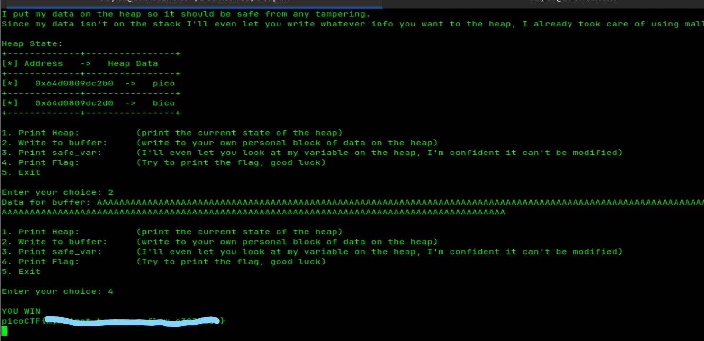

# picoCTF - heap 0

### The Logic
This challenge demonstrates that overflows aren't exclusive to the stack; the **heap** is just as vulnerable. The program places two variables side-by-side in dynamic memory: one for user input and one as a "safe" check variable. The goal is to overflow the first until it spills over and corrupts the second.

### The Attack
I jumped straight to the "Write to buffer" (Option 2) and blasted it with a long string of "A"s. This massive payload exceeded the allocated space, reached the adjacent memory chunk, and overwrote the target variable. Once the memory was corrupted, I just triggered the win condition (Option 4).

**Steps taken:**
1. Selected `2` to write data.
2. Sent a long string of "A"s to trigger the overflow.
3. Selected `4` to print the flag.

### Proof of Concept (PoC)

### Result
The heap corruption was detected, and the flag was successfully captured.
