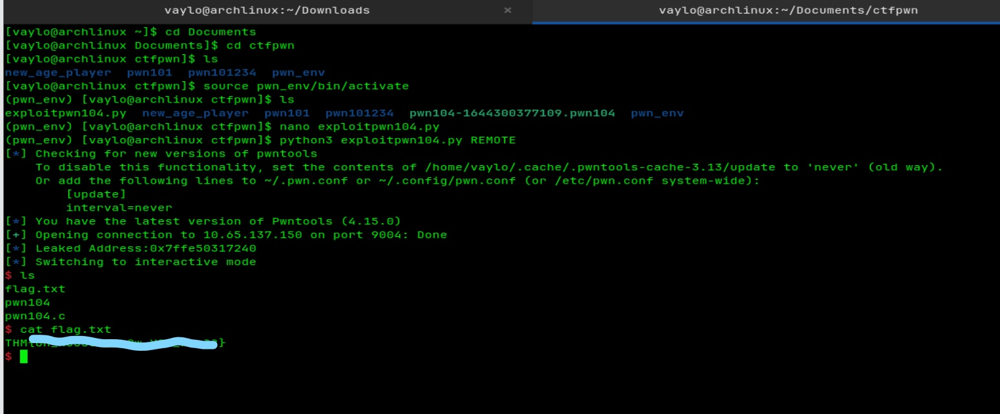

# THM - Pwn104 Writeup

### Target: pwn104 | OS: Arch Linux

## 0x01: Initial Recon
Started with the usual `checksec` routine. This one got interesting:
- **NX is OFF:** This is a huge deal. It means the stack is executable, so we can run our own shellcode if we can jump to it.
- **Canary is OFF:** Still no stack protection, so we're free to overflow.
- **No PIE:** Memory addresses for the binary are static.

## 0x02: Looking under the hood (Static)
Popped the binary into **Ghidra**. The program is quite "generous"—it actually prints out the memory address of the buffer it's using. 
Since **ASLR** (Address Space Layout Randomization) is likely active on the server, this "leak" is our golden ticket. It tells us exactly where our input is sitting in memory at any given run.

## 0x03: Finding the Crash (Dynamic)
I used **GDB-GEF** to find the offset to the Instruction Pointer (RIP).
- Ran the program and noted the leaked address.
- Sent a cyclic pattern.
- GEF showed that the **offset is 88**. 
This means we have 88 bytes of space before we need to provide the return address.

## 0x04: The Attack Plan
Since the stack is executable (NX disabled), the plan is a classic **Shellcode Injection**:
1. Grab the leaked buffer address from the program's output.
2. Create a payload that starts with a **Shellcode** (the actual code to pop a shell).
3. Fill the rest of the 88 bytes with padding ('A's).
4. Overwrite the return address (RIP) with the **leaked buffer address** we caught earlier. 
This forces the CPU to jump back to the start of our buffer and execute our shellcode.

## 0x05: Exploit
I used `shellcraft` from the `pwntools` library to handle the 64-bit shellcode generation.
Check out the full exploit script here: [exploitpwn104.py](./exploitpwn104.py)

---

## 0x06: Result

*Payload delivered. Shell popped. Mission accomplished.*
