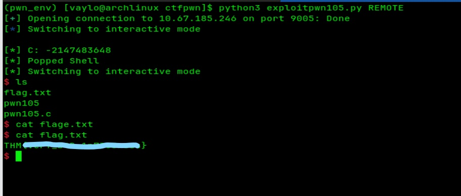

# THM - pwn105 Writeup (Bad Integers)

pwn105 is a classic example of why data types and boundary checks matter. It’s not about smashing the stack; it's about breaking the math.

### The Logic

After reversing the binary in \*\*Ghidra\*\*, I noticed the `main` function asks for two numbers. It has a check to prevent you from entering negative numbers initially. 

However, the vulnerability lies in how it handles the result. The program adds the two numbers, casts the sum to a signed `(int)`, and then checks if that sum is less than zero. If it is, it triggers `system("/bin/sh")`.

### The Trick: Integer Overflow

Since the program treats the sum as a 32-bit signed integer, it has a maximum positive limit of `2,147,483,647`. In computer logic, if you add `1` to this maximum value, the number "wraps around" and becomes the lowest possible negative number.

### Execution

I didn't need a complex payload. I just sent two values that would force this wrap-around:

1\. \*\*First Number:\*\* `2147483647` (The max signed 32-bit int).

2\. \*\*Second Number:\*\* `1`.

The sum overflowed, the program saw a negative result, and I got the shell.

### Lesson Learned

Input validation isn't just about checking if a number is positive or negative; it's about ensuring that arithmetic operations stay within the safe bounds of the allocated data type.

### Exploit

Check out the full exploit script here: [exploitpwn105.py](./exploitpwn105.py)

---

### Result

